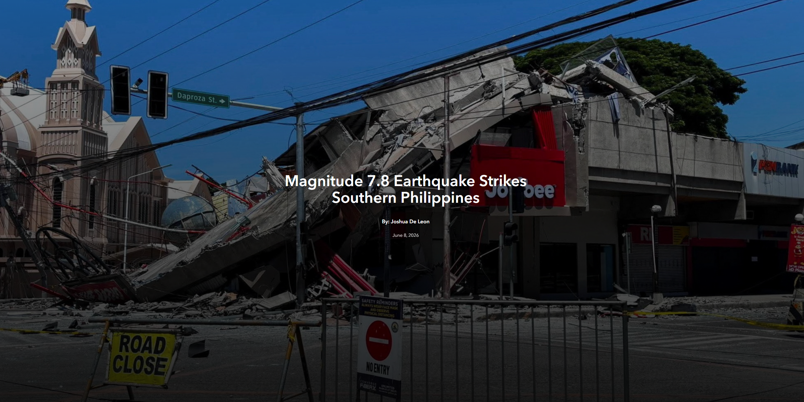
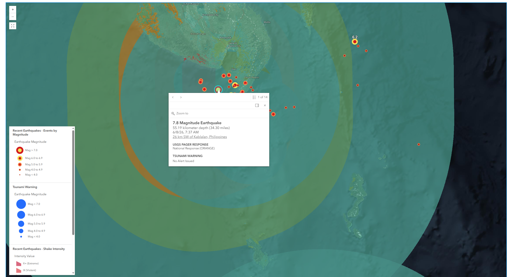

# ArcGIS Maps SDK for JavaScript Vite React 19 TSX template

## Note

This is a contribution information awareness for what happend to the Southern Philippines 7.8 Earthquake.
It uses

Headlines


Epicenter


Ring of Fire


## Tech Stack

1. React
2. Typescript
3. ArcGIS SDK JS
4. ESRI Calcite
5. Vercel

## Getting started

```
npm install
npm run dev
```

## Data Sources

plate tectonics
https://www.arcgis.com/home/item.html?id=3e6ed761b0e74e8c93b477416cf909d2

seismic earthquake
https://www.arcgis.com/home/item.html?id=31cfc5b138e24dee866c457948773ac4
